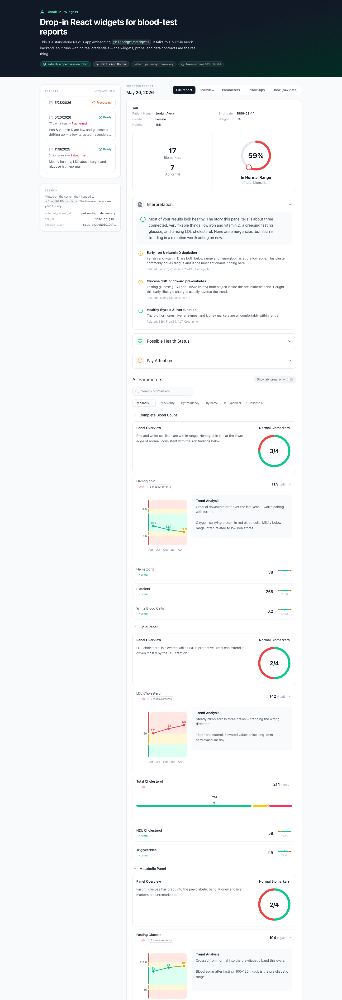

# BloodGPT Widgets — Example App

A standalone **Next.js 15 (App Router)** app that showcases
[`@bloodgpt/widgets`](../bloodgpt-for-business/packages/widgets) — the drop-in
React components that render BloodGPT blood-test reports inside your own
product.

It ships with a **mock backend**, so it runs end-to-end with **no real
credentials**. The widgets, their props, and the API data contracts are the
real thing — point the app at a live backend and it behaves identically.



## What it demonstrates

- All five widgets: **`<ReportsList>`**, **`<TestOverview>`**,
  **`<TestParameters>`**, **`<TestFollowUps>`**, and the composite
  **`<TestReport>`**.
- The **hook escape hatch** (`useTestOverview`) for bringing your own UI.
- The real **auth flow**: a short-lived, patient-scoped **session token** minted
  on the server and handed to `<BloodGPTProvider>` — the browser never sees an
  API key.
- A faithful **mock backend** implementing the documented endpoints with rich,
  realistic (fictional) lab data — including trends, follow-up tiers, and a
  still-processing report.

## Quick start

```bash
pnpm install
cp .env.example .env.local   # optional — sensible defaults are baked in
pnpm dev                     # http://localhost:3100
```

`pnpm build && pnpm start` runs the production build on the same port.

## How it fits together

```
Browser                         Next.js server (this app)
───────                         ─────────────────────────
<BloodGPTProvider               POST /api/v1/widget-sessions     ← mints token
  sessionToken=…                GET  /api/v1/widgets/patients/... ← ReportsList
  apiUrl="" (same origin)>      GET  /api/v1/widgets/tests/:id/overview
  <ReportsList/> <TestReport/>  GET  /api/v1/widgets/tests/:id/parameters
                                GET  /api/v1/widgets/tests/:id/follow-ups
```

| Concern        | Where                                                        |
| -------------- | ------------------------------------------------------------ |
| Token mint     | `src/lib/session.ts`, `src/app/api/v1/widget-sessions`       |
| Mock data      | `src/lib/mock/data.ts`                                        |
| Widget API     | `src/app/api/v1/widgets/**`                                  |
| Provider wiring| `src/components/provider.tsx`, `src/app/page.tsx`           |
| Showcase UI    | `src/components/showcase.tsx`                                 |

### The session-token flow

`src/app/page.tsx` (a Server Component) mints a token and passes it to the
client provider. In production that mint is an HTTP call your server makes with
its API key:

```ts
const res = await fetch(`${API}/api/v1/widget-sessions`, {
  method: "POST",
  headers: { Authorization: `Bearer ${process.env.BLOODGPT_API_KEY}` },
  body: JSON.stringify({ external_patient_id }),
});
const { session_token } = await res.json();
```

That exact endpoint is implemented here too (`src/app/api/v1/widget-sessions`),
so you can exercise it with `curl`:

```bash
curl -X POST http://localhost:3100/api/v1/widget-sessions \
  -H "Authorization: Bearer demo-secret-key" \
  -H "Content-Type: application/json" \
  -d '{"external_patient_id":"patient-jordan-avery"}'
```

## Going live

Set `NEXT_PUBLIC_BLOODGPT_API_URL` to a real BloodGPT deployment and replace the
server-side mint in `src/app/page.tsx` with a real call using your
`BLOODGPT_API_KEY`. Delete `src/app/api/v1/**` and `src/lib/mock/**` once you no
longer need the mock.

## Notes on consuming the package

This example consumes a **vendored copy** of the built widgets package
(`vendor/@bloodgpt/widgets`, referenced via a `file:` dependency) rather than
the monorepo source, so it installs cleanly outside the workspace. Refresh it
after rebuilding the widgets with:

```bash
pnpm sync-widgets   # copies the latest dist from ../bloodgpt-for-business
```

Two integration details worth knowing (both handled for you here):

1. **Styling** — the widgets' prebuilt `styles.css` is utilities-only and, in
   this alpha, incomplete. This app instead generates a complete, brand-accurate
   stylesheet via its own Tailwind build by scanning the vendored bundle and
   re-declaring the BloodGPT design tokens. See `src/app/globals.css`.
2. **`fetch` binding** — the widgets' HTTP client needs `fetch` bound to the
   global; `src/components/provider.tsx` passes a small wrapper via the
   provider's `fetch` prop. It also supplies the `testDetail` / `common`
   message namespaces the components use (the package bundles only `analysis`).

## Disclaimer

All data is fictional and for demonstration only — **not medical advice**.
